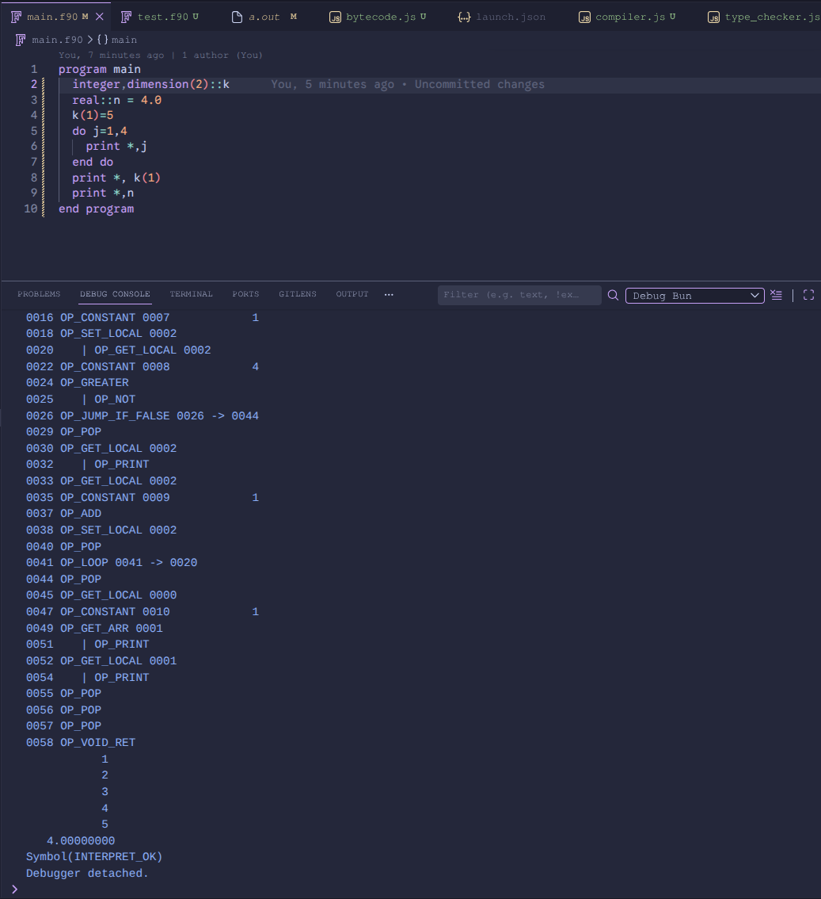

A test to my current knowledge of interpreters and virtual machines, may I present to you the interpreter of Fortran. In plain javascript. That includes:

- A so-called recursive descent parser which produces AST
- A very simple disassembler, primarily useful for debugging the compiler results
- Very simple type-checker 
- Compiler into bytecode system of 29 opcodes, with support for subroutines, arrays and strins

- Code examples (available in tests folder)